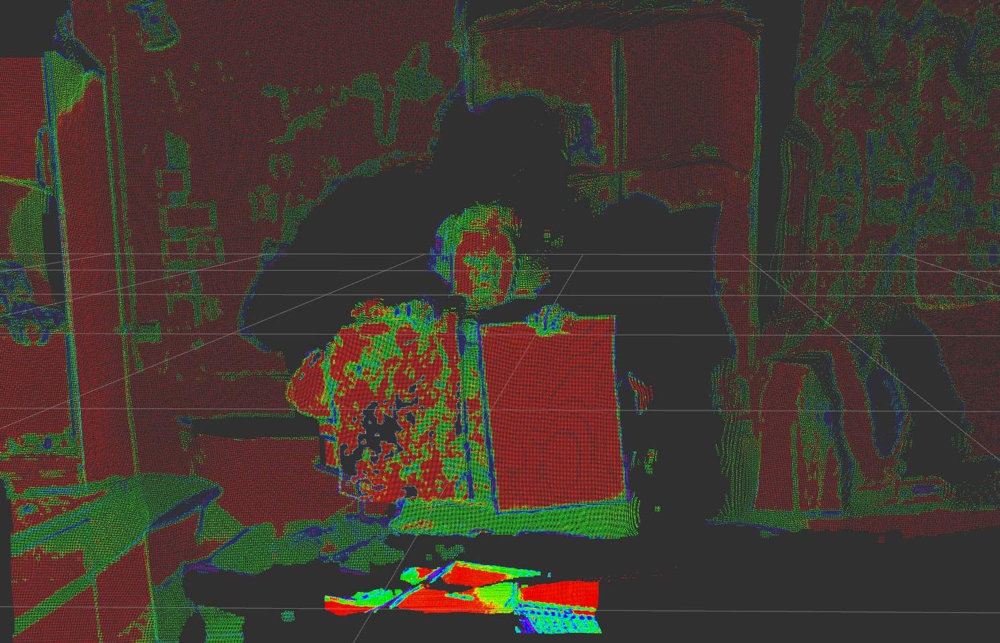

# Pseudo-Lidar-from-Stereo-Point-Cloud
This is a ROS2 package that merges stereo point cloud with a confidence mapped point cloud, a resulting confidence mapped point cloud can be sen below.

The confidence mapped point cloud aims to imitate a LIDAR point cloud by assigning a confidence value the intensity channel of each point.

The confidence map and stereo pair point cloud are assumed to be published simultaneously. Chaning the topic names of the confidence map and stereo pair point cloud can be done in [src/pseudo_LIDAR_from_pc.cpp](src/pseudo_LIDAR_from_pc.cpp)